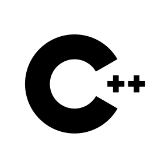

--><h1 align="center"> 🍁 Holla Folks !</h1>

<h3 align="center">Hope you are doing good,Thanks for visiting my profile</h3> 

  

  

- 🔭 currently **a Senior from Bundelkhand University**

- 🌱 I’m currently learning **Web development**

- 📫 How to reach me **reach.nandanipaliwal@gmail.com**

- ⚡ Fun fact **Love to play Chess**

<h3 align="center">Connect with me:</h3> 

 

<h3 align="center" font-weight="400">Languages and Tools:</h3> 

 
 
 
 

 

<!-- 

&nbsp;

 -->
